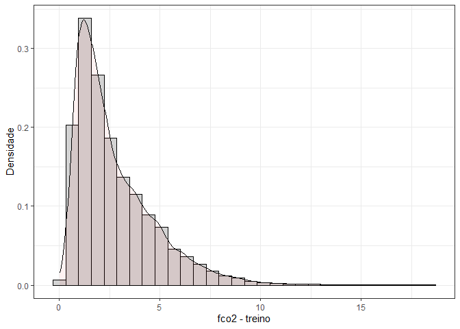
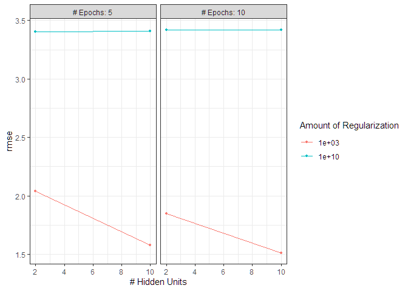
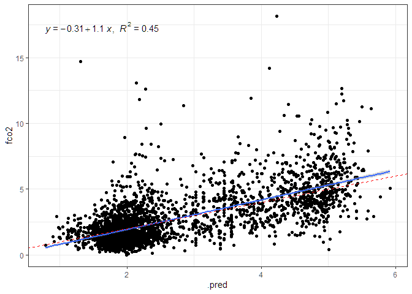
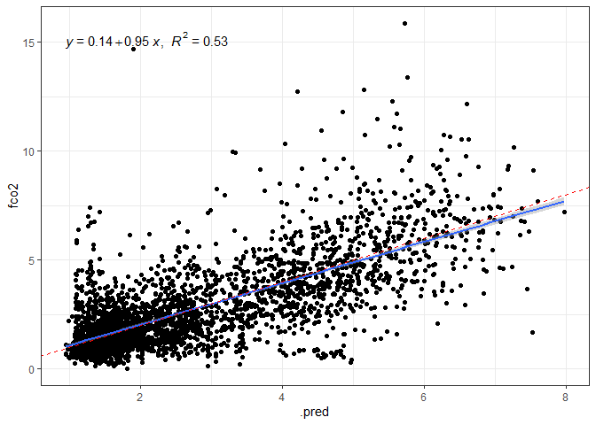

<!-- README.md is generated from README.Rmd. Please edit that file -->

# APRENDIZADO DE MÁQUINA ESTATÍSTICO PARA ESTIMATIVA DA EMISSÃO DE CO<sub>2</sub> DO SOLO EM ÁREAS AGRÍCOLAS

**Beneficiário**: Luis Felipe Trevelim

**Responsável**: Alan Rodrigo Panosso

**Resumo**: A concentração de gases de efeito estufa (GEE) na atmosfera,
como o dióxido de carbono (CO<sub>2</sub>), aumentou consideravelmente
devido a fontes antropogênicas. No Brasil, atividades agrícolas e
florestais contribuem substancialmente para as emissões de
CO<sub>2</sub>, principalmente devido ao desmatamento e à conversão de
florestas nativas. Estudos anteriores demonstraram que FCO2 pode ser
modelada com alta precisão usando uma grande quantidade de variáveis
ambientais. No entanto, a conversão a longo prazo de florestas nativas
para agroecossistemas ainda é pouco compreendida, especialmente no
contexto brasileiro. Assim, a hipótese central é que as mudanças no uso
da terra para fins agrícolas alteram os atributos químicos e físicos do
solo, induzindo mudanças na emissão de CO2. Este projeto visa investigar
a emissão de CO<sub>2</sub> do solo (FCO2) em áreas agrícolas do bioma
Cerrado, utilizando técnicas de aprendizado de máquina estatístico para
modelar FCO2 com base em demais variáveis associadas.

**Palavras-chaves**: respiração do solo, inteligência artificial,
mudanças climáticas, aprendizado de máquina.

### [1-Faxina](https://arpanosso.github.io/projeto-trevelimlf/Docs/faxina.html)

### [2-Importação e Tratamento](https://arpanosso.github.io/projeto-trevelimlf/Docs/importacao_tratamento.html)

### 3 - Aprendizado de Máquina

#### Carregando os pacotes

``` r
library(tidyverse)
library(patchwork)
library(ggspatial)
library(readxl)
library(skimr)
library(tidymodels)
library(ISLR)
library(modeldata)
library(vip)
library(ggpubr)
theme_set(theme_bw())
```

#### Entrando com o banco de dados

``` r
data_set <- read_rds("data/data-set.rds")
glimpse(data_set)
#> Rows: 14,977
#> Columns: 51
#> $ data           <dttm> 2001-07-10, 2001-07-10, 2001-07-10, 2001-07-10, 2001-0…
#> $ year           <dbl> 2001, 2001, 2001, 2001, 2001, 2001, 2001, 2001, 2001, 2…
#> $ month          <dbl> 7, 7, 7, 7, 7, 7, 7, 7, 7, 7, 7, 7, 7, 7, 7, 7, 7, 7, 7…
#> $ cultura        <chr> "milho_soja", "milho_soja", "milho_soja", "milho_soja",…
#> $ x              <dbl> 0, 40, 80, 10, 25, 40, 55, 70, 20, 40, 60, 10, 70, 30, …
#> $ y              <dbl> 0, 0, 0, 10, 10, 10, 10, 10, 20, 20, 20, 25, 25, 30, 30…
#> $ longitude_muni <dbl> -48.29829, -48.29829, -48.29829, -48.29829, -48.29829, …
#> $ latitude_muni  <dbl> -21.20178, -21.20178, -21.20178, -21.20178, -21.20178, …
#> $ experimento    <chr> "Espacial", "Espacial", "Espacial", "Espacial", "Espaci…
#> $ manejo         <fct> convencional, convencional, convencional, convencional,…
#> $ tratamento     <fct> AD_GN, AD_GN, AD_GN, AD_GN, AD_GN, AD_GN, AD_GN, AD_GN,…
#> $ fco2           <dbl> 1.080, 0.825, 1.950, 0.534, 0.893, 0.840, 1.110, 1.840,…
#> $ ts             <dbl> 18.73, 18.40, 19.20, 18.28, 18.35, 18.47, 19.10, 18.77,…
#> $ us             <dbl> NA, NA, NA, NA, NA, NA, NA, NA, NA, NA, NA, NA, NA, NA,…
#> $ ph             <dbl> 5.1, 5.1, 5.8, 5.3, 5.5, 5.7, 5.6, 6.4, 5.3, 5.8, 5.5, …
#> $ mo             <dbl> 20, 24, 25, 23, 23, 21, 26, 23, 25, 24, 26, 20, 25, 25,…
#> $ p              <dbl> 46, 26, 46, 78, 60, 46, 55, 92, 55, 60, 48, 71, 125, 38…
#> $ k              <dbl> 2.4, 2.2, 5.3, 3.6, 3.4, 2.9, 4.0, 2.3, 3.3, 3.6, 4.1, …
#> $ ca             <dbl> 25, 30, 41, 27, 33, 38, 35, 28, 29, 36, 37, 29, 50, 27,…
#> $ mg             <dbl> 11, 11, 25, 11, 15, 20, 16, 12, 11, 17, 15, 11, 30, 10,…
#> $ h_al           <dbl> 31, 31, 22, 28, 27, 22, 22, 12, 31, 28, 28, 31, 18, 31,…
#> $ sb             <dbl> 38.4, 43.2, 71.3, 41.6, 50.6, 60.9, 55.0, 44.2, 43.3, 5…
#> $ ctc            <dbl> 69.4, 74.2, 93.3, 69.6, 77.9, 82.9, 77.0, 173.3, 74.3, …
#> $ v              <dbl> 55, 58, 76, 60, 65, 73, 71, 93, 58, 67, 67, 58, 82, 57,…
#> $ ds             <dbl> NA, NA, NA, NA, NA, NA, NA, NA, NA, NA, NA, NA, NA, NA,…
#> $ macro          <dbl> NA, NA, NA, NA, NA, NA, NA, NA, NA, NA, NA, NA, NA, NA,…
#> $ micro          <dbl> NA, NA, NA, NA, NA, NA, NA, NA, NA, NA, NA, NA, NA, NA,…
#> $ vtp            <dbl> NA, NA, NA, NA, NA, NA, NA, NA, NA, NA, NA, NA, NA, NA,…
#> $ pla            <dbl> NA, NA, NA, NA, NA, NA, NA, NA, NA, NA, NA, NA, NA, NA,…
#> $ at             <dbl> NA, NA, NA, NA, NA, NA, NA, NA, NA, NA, NA, NA, NA, NA,…
#> $ silte          <dbl> NA, NA, NA, NA, NA, NA, NA, NA, NA, NA, NA, NA, NA, NA,…
#> $ arg            <dbl> NA, NA, NA, NA, NA, NA, NA, NA, NA, NA, NA, NA, NA, NA,…
#> $ hlifs          <dbl> NA, NA, NA, NA, NA, NA, NA, NA, NA, NA, NA, NA, NA, NA,…
#> $ xco2_trend     <dbl> NA, NA, NA, NA, NA, NA, NA, NA, NA, NA, NA, NA, NA, NA,…
#> $ xco2           <dbl> NA, NA, NA, NA, NA, NA, NA, NA, NA, NA, NA, NA, NA, NA,…
#> $ sif            <dbl> NA, NA, NA, NA, NA, NA, NA, NA, NA, NA, NA, NA, NA, NA,…
#> $ tmed           <dbl> 19.9, 19.9, 19.9, 19.9, 19.9, 19.9, 19.9, 19.9, 19.9, 1…
#> $ tmax           <dbl> NA, NA, NA, NA, NA, NA, NA, NA, NA, NA, NA, NA, NA, NA,…
#> $ tmin           <dbl> NA, NA, NA, NA, NA, NA, NA, NA, NA, NA, NA, NA, NA, NA,…
#> $ umed           <dbl> 58.9, 58.9, 58.9, 58.9, 58.9, 58.9, 58.9, 58.9, 58.9, 5…
#> $ umax           <dbl> NA, NA, NA, NA, NA, NA, NA, NA, NA, NA, NA, NA, NA, NA,…
#> $ umin           <dbl> NA, NA, NA, NA, NA, NA, NA, NA, NA, NA, NA, NA, NA, NA,…
#> $ pk_pa          <dbl> 94.65, 94.65, 94.65, 94.65, 94.65, 94.65, 94.65, 94.65,…
#> $ rad            <dbl> 16.01, 16.01, 16.01, 16.01, 16.01, 16.01, 16.01, 16.01,…
#> $ par            <dbl> NA, NA, NA, NA, NA, NA, NA, NA, NA, NA, NA, NA, NA, NA,…
#> $ eto            <dbl> 6.98, 6.98, 6.98, 6.98, 6.98, 6.98, 6.98, 6.98, 6.98, 6…
#> $ velmax         <dbl> NA, NA, NA, NA, NA, NA, NA, NA, NA, NA, NA, NA, NA, NA,…
#> $ velmin         <dbl> NA, NA, NA, NA, NA, NA, NA, NA, NA, NA, NA, NA, NA, NA,…
#> $ dir_vel        <dbl> NA, NA, NA, NA, NA, NA, NA, NA, NA, NA, NA, NA, NA, NA,…
#> $ chuva          <dbl> 0, 0, 0, 0, 0, 0, 0, 0, 0, 0, 0, 0, 0, 0, 0, 0, 0, 0, 0…
#> $ inso           <dbl> 10.1, 10.1, 10.1, 10.1, 10.1, 10.1, 10.1, 10.1, 10.1, 1…
```

### Dividindo a base entre treino e teste

``` r
fco2_initial_split <- initial_split(data_set, prop = 0.80)
fco2_train <- training(fco2_initial_split)
# fco2_test <- testing(fco2_initial_split)
# visdat::vis_miss(fco2_test)
fco2_train  %>% 
  ggplot(aes(x=fco2, y=..density..))+
  geom_histogram(bins = 30, color="black",  fill="lightgray")+
  geom_density(alpha=.05,fill="red")+
  theme_bw() +
  labs(x="fco2 - treino", y = "Densidade")
```

<!-- -->

``` r
fco2_testing <- testing(fco2_initial_split)
fco2_testing  %>% 
  ggplot(aes(x=fco2, y=..density..))+
  geom_histogram(bins = 30, color="black",  fill="lightgray")+
  geom_density(alpha=.05,fill="blue")+
  theme_bw() +
  labs(x="fco2 - teste", y = "Densidade")
```

<!-- -->

### Definindo a Reamostragem

``` r
fco2_resamples <- vfold_cv(fco2_train, v = 5)
```

## REDE NEURAL ARTIFICIAL

``` r
fco2_recipe <- recipe(fco2 ~ ., 
                      data = fco2_train %>% 
            select(fco2:inso) 
) %>%  
  step_normalize(all_numeric_predictors())  %>% 
  step_naomit() %>%  
  step_novel(all_nominal_predictors()) %>% 
  step_zv(all_predictors()) %>%
  # step_naomit(c(ts, us)) %>% 
  step_impute_median(where(is.numeric)) %>% # inputação da mediana nos numéricos
  # step_poly(c(Us,Ts), degree = 2)  %>%  
  step_dummy(all_nominal_predictors())
bake(prep(fco2_recipe), new_data = NULL)
#> # A tibble: 11,981 × 40
#>         ts     us      ph      mo      p      k     ca      mg    h_al      sb
#>      <dbl>  <dbl>   <dbl>   <dbl>  <dbl>  <dbl>  <dbl>   <dbl>   <dbl>   <dbl>
#>  1  0.527   0.206 -0.845   0.0694 -0.775 -0.685 -0.594  0.120   0.333  -0.481 
#>  2 -0.0801 -0.134 -0.192  -1.55    5.93  -1.07  -0.893 -1.80   -1.57   -1.26  
#>  3  0.982  -0.247 -0.682   0.959  -0.473 -0.313 -0.386  0.693   0.542  -0.132 
#>  4  1.27   -0.700 -0.0285 -0.416  -0.321 -0.592 -0.525 -0.453  -0.360  -0.573 
#>  5  0.257  -0.421 -1.17    0.393  -0.876 -0.313 -0.871 -0.262  -1.68   -0.747 
#>  6  0.0211 -0.248  0.788  -0.254  -0.725 -0.872 -0.247  1.08   -1.05    0.0112
#>  7  1.01    0.885  0.298   0.0694 -0.170  1.78   0.931  1.08   -0.0482  1.17  
#>  8 -3.50    0.840 -0.845  -1.47    0.586 -0.220 -0.594  0.120   1.72   -0.430 
#>  9  1.17   -0.813 -1.01    0.474  -0.674  0.106 -0.733 -0.0709  1.37   -0.547 
#> 10  0.696  -1.15   0.951   1.44   -0.473 -0.220  2.60   1.65   -0.499   2.34  
#> # ℹ 11,971 more rows
#> # ℹ 30 more variables: ctc <dbl>, v <dbl>, ds <dbl>, macro <dbl>, micro <dbl>,
#> #   vtp <dbl>, pla <dbl>, at <dbl>, silte <dbl>, arg <dbl>, hlifs <dbl>,
#> #   xco2_trend <dbl>, xco2 <dbl>, sif <dbl>, tmed <dbl>, tmax <dbl>,
#> #   tmin <dbl>, umed <dbl>, umax <dbl>, umin <dbl>, pk_pa <dbl>, rad <dbl>,
#> #   par <dbl>, eto <dbl>, velmax <dbl>, velmin <dbl>, dir_vel <dbl>,
#> #   chuva <dbl>, inso <dbl>, fco2 <dbl>
```

#### Definição do Modelo de RNA - MultiLayer Perceptron

``` r
fco2_nn_model <- mlp(
  hidden_units = 4) %>% # margin sempre para regressão
  set_mode("regression") %>%
  set_engine("nnet")
```

#### Definir os parâmetros da tunagem

``` r
fco2_nn_model <- mlp(
  hidden_units = tune(),
  penalty = tune(),
  epochs = tune()
  ) %>% # margin sempre para regressão
  set_mode("regression") %>%
  set_engine("nnet")
```

#### Workflow e tunagem

``` r
fco2_nn_wf <- workflow()   %>%
  add_model(fco2_nn_model) %>%
  add_recipe(fco2_recipe)
# Criando a matriz (grid) com os valores de hiperparâmetros a serem testados
# grid_nn <- expand.grid(
#   hidden_units = c(1,5,6,7,8,15), #c(1,5,6,7,8,15)
#   penalty = c(1,20),  #c(1,5,10,20)
#   epochs = c(50,1000) # c(50,100,500,1000)
# )

grid_nn <- grid_regular(
  hidden_units(range = c(2, 10)), ## tentar até 250
  penalty(range = c(3, 10)), ## no máximo 30
  epochs(range = c(5, 10)),
  levels = c(2, 2, 2)
)
glimpse(grid_nn)
#> Rows: 8
#> Columns: 3
#> $ hidden_units <int> 2, 10, 2, 10, 2, 10, 2, 10
#> $ penalty      <dbl> 1e+03, 1e+03, 1e+10, 1e+10, 1e+03, 1e+03, 1e+10, 1e+10
#> $ epochs       <int> 5, 5, 5, 5, 10, 10, 10, 10

fco2_nn_tune_grid <- tune_grid(
  fco2_nn_wf,
  resamples = fco2_resamples,
  grid = grid_nn,
  metrics = metric_set(rmse)
)
autoplot(fco2_nn_tune_grid)
```

<!-- -->

### Coletando métricas

``` r
collect_metrics(fco2_nn_tune_grid)
#> # A tibble: 8 × 9
#>   hidden_units     penalty epochs .metric .estimator  mean     n std_err .config
#>          <int>       <dbl>  <int> <chr>   <chr>      <dbl> <int>   <dbl> <chr>  
#> 1            2        1000      5 rmse    standard    2.04     5  0.0901 Prepro…
#> 2           10        1000      5 rmse    standard    1.58     5  0.0106 Prepro…
#> 3            2 10000000000      5 rmse    standard    3.40     5  0.0386 Prepro…
#> 4           10 10000000000      5 rmse    standard    3.41     5  0.0401 Prepro…
#> 5            2        1000     10 rmse    standard    1.85     5  0.0463 Prepro…
#> 6           10        1000     10 rmse    standard    1.51     5  0.0236 Prepro…
#> 7            2 10000000000     10 rmse    standard    3.42     5  0.0223 Prepro…
#> 8           10 10000000000     10 rmse    standard    3.42     5  0.0210 Prepro…
fco2_nn_tune_grid %>%
  show_best(metric = "rmse", n = 6)
#> # A tibble: 6 × 9
#>   hidden_units     penalty epochs .metric .estimator  mean     n std_err .config
#>          <int>       <dbl>  <int> <chr>   <chr>      <dbl> <int>   <dbl> <chr>  
#> 1           10        1000     10 rmse    standard    1.51     5  0.0236 Prepro…
#> 2           10        1000      5 rmse    standard    1.58     5  0.0106 Prepro…
#> 3            2        1000     10 rmse    standard    1.85     5  0.0463 Prepro…
#> 4            2        1000      5 rmse    standard    2.04     5  0.0901 Prepro…
#> 5            2 10000000000      5 rmse    standard    3.40     5  0.0386 Prepro…
#> 6           10 10000000000      5 rmse    standard    3.41     5  0.0401 Prepro…
```

### Desempenho do modelo final

``` r
fco2_nn_best_params <- select_best(fco2_nn_tune_grid, metric = "rmse")
fco2_nn_wf <- fco2_nn_wf %>%
  finalize_workflow(fco2_nn_best_params)
fco2_nn_last_fit <- last_fit(fco2_nn_wf, fco2_initial_split)

## Criando os preditos
fco2_test_preds <- bind_rows(
  collect_predictions(fco2_nn_last_fit)  %>%
    mutate(modelo = "nn"))

fco2_test <- testing(fco2_initial_split)

fco2_test_preds %>%
  ggplot(aes(x=.pred, y=fco2)) +
  geom_point()+
  theme_bw() +
  geom_smooth(method = "lm") +
  stat_regline_equation(ggplot2::aes(
  label =  paste(..eq.label.., ..rr.label.., sep = "*plain(\",\")~~"))) +
  geom_abline (slope=1, linetype = "dashed", color="Red")
```

<!-- -->

``` r
fco2_nn_last_fit_model <- fco2_nn_last_fit$.workflow[[1]]$fit$fit
vip(fco2_nn_last_fit_model,
    aesthetics = list(color = "black", fill = "orange")) +
    theme(axis.text.y=element_text(size=rel(1.5)),
          axis.text.x=element_text(size=rel(1.5)),
          axis.title.x=element_text(size=rel(1.5))
          ) +
  theme_bw()
```

<!-- -->

``` r
features <- rownames(fco2_nn_last_fit_model$fit$importance)
importance_top_10 <- fco2_nn_last_fit_model$fit$importance |> 
  as_tibble() |> 
  add_column(feature = features) |> 
  arrange(desc(IncNodePurity)) |> 
  relocate(feature) |> 
  slice(1:10)

atr_fisicos <- features[c(14:17,19:21)]
atr_quimicos <- features[c(4:13)]
atr_dinamicos <- features[c(2,3,18)]
atr_climaticos <- features[c(22:34)]
atr_orbitais <- features[c(35:36)]

importance_top_10 |> 
  arrange(IncNodePurity) |> 
  mutate(feature_type = case_when(
    feature %in% atr_fisicos   ~ "físicos",
    feature %in% atr_quimicos  ~ "químicos",
    feature %in% atr_dinamicos ~ "dinâmicos",
    feature %in% atr_climaticos ~ "climáticos",
    feature %in% atr_orbitais  ~ "orbitais",
    TRUE                        ~ "outro"
  ),
  feature = feature |> fct_reorder(IncNodePurity)) |> 
  ggplot(aes(x=IncNodePurity, y=feature, fill = feature_type)) +
  geom_col(color="black") +
  theme_bw()+
  labs(x = "Importância",y="",
       fill="Grupo") +
  theme(legend.position = "top") +
  scale_fill_viridis_d()
```

### Principais Métricas

``` r
da <- fco2_test_preds %>%
  filter(fco2 > 0, .pred>0 )

my_r <- cor(da$fco2,da$.pred)
my_r2 <- my_r*my_r
my_mse <- Metrics::mse(da$fco2,da$.pred)
my_rmse <- Metrics::rmse(da$fco2,
                         da$.pred)
my_mae <- Metrics::mae(da$fco2,da$.pred)
my_mape <- Metrics::mape(da$fco2,da$.pred)*100

vector_of_metrics <- c(r=my_r, R2=my_r2, MSE=my_mse, RMSE=my_rmse, MAE=my_mae, MAPE=my_mape)
print(data.frame(vector_of_metrics))
#>      vector_of_metrics
#> r            0.6735429
#> R2           0.4536600
#> MSE          2.1730099
#> RMSE         1.4741133
#> MAE          1.0309772
#> MAPE        61.9682722
#>      vector_of_metrics
#> r            0.6787708
#> R2           0.4607298
#> MSE          0.1984555
#> RMSE         0.4454834
#> MAE          0.3259117
#> MAPE        25.2042723
```
