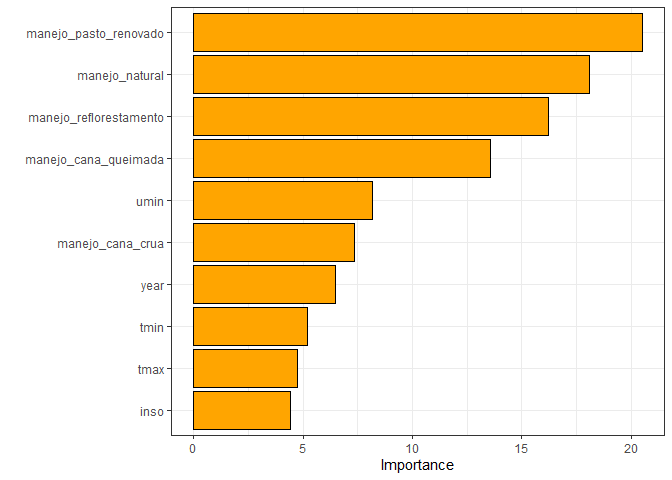

<!-- README.md is generated from README.Rmd. Please edit that file -->

# APRENDIZADO DE MÁQUINA ESTATÍSTICO PARA ESTIMATIVA DA EMISSÃO DE CO<sub>2</sub> DO SOLO EM ÁREAS AGRÍCOLAS

**Beneficiário**: Luis Felipe Trevelim

**Responsável**: Alan Rodrigo Panosso

**Resumo**: A concentração de gases de efeito estufa (GEE) na atmosfera,
como o dióxido de carbono (CO<sub>2</sub>), aumentou consideravelmente
devido a fontes antropogênicas. No Brasil, atividades agrícolas e
florestais contribuem substancialmente para as emissões de
CO<sub>2</sub>, principalmente devido ao desmatamento e à conversão de
florestas nativas. Estudos anteriores demonstraram que FCO2 pode ser
modelada com alta precisão usando uma grande quantidade de variáveis
ambientais. No entanto, a conversão a longo prazo de florestas nativas
para agroecossistemas ainda é pouco compreendida, especialmente no
contexto brasileiro. Assim, a hipótese central é que as mudanças no uso
da terra para fins agrícolas alteram os atributos químicos e físicos do
solo, induzindo mudanças na emissão de CO2. Este projeto visa investigar
a emissão de CO<sub>2</sub> do solo (FCO2) em áreas agrícolas do bioma
Cerrado, utilizando técnicas de aprendizado de máquina estatístico para
modelar FCO2 com base em demais variáveis associadas.

**Palavras-chaves**: respiração do solo, inteligência artificial,
mudanças climáticas, aprendizado de máquina.

### [1-Faxina](https://arpanosso.github.io/projeto-trevelimlf/Docs/faxina.html)

### [2-Importação e Tratamento](https://arpanosso.github.io/projeto-trevelimlf/Docs/importacao_tratamento.html)

### 3 - Aprendizado de Máquina

#### Carregando os pacotes

``` r
library(tidyverse)
library(patchwork)
library(ggspatial)
library(readxl)
library(skimr)
library(tidymodels)
library(ISLR)
library(modeldata)
library(vip)
library(ggpubr)
theme_set(theme_bw())
```

#### Entrando com o banco de dados

``` r
data_set <- read_rds("data/data-set.rds")
glimpse(data_set)
#> Rows: 14,977
#> Columns: 51
#> $ data           <dttm> 2001-07-10, 2001-07-10, 2001-07-10, 2001-07-10, 2001-0…
#> $ year           <dbl> 2001, 2001, 2001, 2001, 2001, 2001, 2001, 2001, 2001, 2…
#> $ month          <dbl> 7, 7, 7, 7, 7, 7, 7, 7, 7, 7, 7, 7, 7, 7, 7, 7, 7, 7, 7…
#> $ cultura        <chr> "milho_soja", "milho_soja", "milho_soja", "milho_soja",…
#> $ x              <dbl> 0, 40, 80, 10, 25, 40, 55, 70, 20, 40, 60, 10, 70, 30, …
#> $ y              <dbl> 0, 0, 0, 10, 10, 10, 10, 10, 20, 20, 20, 25, 25, 30, 30…
#> $ longitude_muni <dbl> -48.29829, -48.29829, -48.29829, -48.29829, -48.29829, …
#> $ latitude_muni  <dbl> -21.20178, -21.20178, -21.20178, -21.20178, -21.20178, …
#> $ experimento    <chr> "Espacial", "Espacial", "Espacial", "Espacial", "Espaci…
#> $ manejo         <fct> convencional, convencional, convencional, convencional,…
#> $ tratamento     <fct> AD_GN, AD_GN, AD_GN, AD_GN, AD_GN, AD_GN, AD_GN, AD_GN,…
#> $ fco2           <dbl> 1.080, 0.825, 1.950, 0.534, 0.893, 0.840, 1.110, 1.840,…
#> $ ts             <dbl> 18.73, 18.40, 19.20, 18.28, 18.35, 18.47, 19.10, 18.77,…
#> $ us             <dbl> NA, NA, NA, NA, NA, NA, NA, NA, NA, NA, NA, NA, NA, NA,…
#> $ ph             <dbl> 5.1, 5.1, 5.8, 5.3, 5.5, 5.7, 5.6, 6.4, 5.3, 5.8, 5.5, …
#> $ mo             <dbl> 20, 24, 25, 23, 23, 21, 26, 23, 25, 24, 26, 20, 25, 25,…
#> $ p              <dbl> 46, 26, 46, 78, 60, 46, 55, 92, 55, 60, 48, 71, 125, 38…
#> $ k              <dbl> 2.4, 2.2, 5.3, 3.6, 3.4, 2.9, 4.0, 2.3, 3.3, 3.6, 4.1, …
#> $ ca             <dbl> 25, 30, 41, 27, 33, 38, 35, 28, 29, 36, 37, 29, 50, 27,…
#> $ mg             <dbl> 11, 11, 25, 11, 15, 20, 16, 12, 11, 17, 15, 11, 30, 10,…
#> $ h_al           <dbl> 31, 31, 22, 28, 27, 22, 22, 12, 31, 28, 28, 31, 18, 31,…
#> $ sb             <dbl> 38.4, 43.2, 71.3, 41.6, 50.6, 60.9, 55.0, 44.2, 43.3, 5…
#> $ ctc            <dbl> 69.4, 74.2, 93.3, 69.6, 77.9, 82.9, 77.0, 173.3, 74.3, …
#> $ v              <dbl> 55, 58, 76, 60, 65, 73, 71, 93, 58, 67, 67, 58, 82, 57,…
#> $ ds             <dbl> NA, NA, NA, NA, NA, NA, NA, NA, NA, NA, NA, NA, NA, NA,…
#> $ macro          <dbl> NA, NA, NA, NA, NA, NA, NA, NA, NA, NA, NA, NA, NA, NA,…
#> $ micro          <dbl> NA, NA, NA, NA, NA, NA, NA, NA, NA, NA, NA, NA, NA, NA,…
#> $ vtp            <dbl> NA, NA, NA, NA, NA, NA, NA, NA, NA, NA, NA, NA, NA, NA,…
#> $ pla            <dbl> NA, NA, NA, NA, NA, NA, NA, NA, NA, NA, NA, NA, NA, NA,…
#> $ at             <dbl> NA, NA, NA, NA, NA, NA, NA, NA, NA, NA, NA, NA, NA, NA,…
#> $ silte          <dbl> NA, NA, NA, NA, NA, NA, NA, NA, NA, NA, NA, NA, NA, NA,…
#> $ arg            <dbl> NA, NA, NA, NA, NA, NA, NA, NA, NA, NA, NA, NA, NA, NA,…
#> $ hlifs          <dbl> NA, NA, NA, NA, NA, NA, NA, NA, NA, NA, NA, NA, NA, NA,…
#> $ xco2_trend     <dbl> NA, NA, NA, NA, NA, NA, NA, NA, NA, NA, NA, NA, NA, NA,…
#> $ xco2           <dbl> NA, NA, NA, NA, NA, NA, NA, NA, NA, NA, NA, NA, NA, NA,…
#> $ sif            <dbl> NA, NA, NA, NA, NA, NA, NA, NA, NA, NA, NA, NA, NA, NA,…
#> $ tmed           <dbl> 19.9, 19.9, 19.9, 19.9, 19.9, 19.9, 19.9, 19.9, 19.9, 1…
#> $ tmax           <dbl> NA, NA, NA, NA, NA, NA, NA, NA, NA, NA, NA, NA, NA, NA,…
#> $ tmin           <dbl> NA, NA, NA, NA, NA, NA, NA, NA, NA, NA, NA, NA, NA, NA,…
#> $ umed           <dbl> 58.9, 58.9, 58.9, 58.9, 58.9, 58.9, 58.9, 58.9, 58.9, 5…
#> $ umax           <dbl> NA, NA, NA, NA, NA, NA, NA, NA, NA, NA, NA, NA, NA, NA,…
#> $ umin           <dbl> NA, NA, NA, NA, NA, NA, NA, NA, NA, NA, NA, NA, NA, NA,…
#> $ pk_pa          <dbl> 94.65, 94.65, 94.65, 94.65, 94.65, 94.65, 94.65, 94.65,…
#> $ rad            <dbl> 16.01, 16.01, 16.01, 16.01, 16.01, 16.01, 16.01, 16.01,…
#> $ par            <dbl> NA, NA, NA, NA, NA, NA, NA, NA, NA, NA, NA, NA, NA, NA,…
#> $ eto            <dbl> 6.98, 6.98, 6.98, 6.98, 6.98, 6.98, 6.98, 6.98, 6.98, 6…
#> $ velmax         <dbl> NA, NA, NA, NA, NA, NA, NA, NA, NA, NA, NA, NA, NA, NA,…
#> $ velmin         <dbl> NA, NA, NA, NA, NA, NA, NA, NA, NA, NA, NA, NA, NA, NA,…
#> $ dir_vel        <dbl> NA, NA, NA, NA, NA, NA, NA, NA, NA, NA, NA, NA, NA, NA,…
#> $ chuva          <dbl> 0, 0, 0, 0, 0, 0, 0, 0, 0, 0, 0, 0, 0, 0, 0, 0, 0, 0, 0…
#> $ inso           <dbl> 10.1, 10.1, 10.1, 10.1, 10.1, 10.1, 10.1, 10.1, 10.1, 1…
```

##### Extraindo o grupo de variáveis

``` r
time_var <- data_set |> select(data:month) |> names()
catego_var <- data_set |> select(cultura, manejo, tratamento) |> names()
din_var <- data_set |> select(fco2:us,pla) |> names()
chemical_var <- data_set |> select(ph:v,hlifs) |> names()
physical_var <- data_set |> select(ds:vtp) |> names()
textural_var <- data_set |> select(at:arg) |> names()
textural_var <- data_set |> select(at:arg) |> names()
orbital_var <- data_set |> select(xco2_trend:sif) |> names()
meteorological_var <- data_set |> select(tmed:inso) |> names()
```

### Dividindo a base entre treino e teste

``` r
fco2_initial_split <- initial_split(data_set, prop = 0.80)
fco2_train <- training(fco2_initial_split)
# fco2_test <- testing(fco2_initial_split)
# visdat::vis_miss(fco2_test)
fco2_train  |>  
  ggplot(aes(x=fco2, y=..density..))+
  geom_histogram(bins = 30, color="black",  fill="lightgray")+
  geom_density(alpha=.05,fill="red")+
  theme_bw() +
  labs(x="fco2 - treino", y = "Densidade")
```

<!-- -->

``` r
fco2_testing <- testing(fco2_initial_split)
fco2_testing  |>  
  ggplot(aes(x=fco2, y=..density..))+
  geom_histogram(bins = 30, color="black",  fill="lightgray")+
  geom_density(alpha=.05,fill="blue")+
  theme_bw() +
  labs(x="fco2 - teste", y = "Densidade")
```

<!-- -->

### Definindo a Reamostragem

``` r
fco2_resamples <- vfold_cv(fco2_train, v = 5)
```

## REDE NEURAL ARTIFICIAL

``` r
fco2_recipe <- recipe(fco2 ~ ., 
                      data = fco2_train |>  
            select(year,manejo, fco2:inso, -xco2_trend) # 
) |>   
  # step_naomit(all_outcomes()) |>  # remove linhas sem fco2  
  step_naomit(c(ts, us)) |>  # retira NAs somente de ts e us
  step_novel(all_nominal_predictors()) |>  # evitar problemas quando aparece categoria nova
  step_zv(all_predictors()) |> # evita problemas com variância zero 
  step_poly(c(us,ts), degree = 2)  |> #polinômios de us e ts de grau 2  
  step_impute_median(all_numeric_predictors()) |>  # inputação da mediana - antes de normalize
  step_normalize(all_numeric_predictors())  |>  # padronização normal (x-mu)/sigmma
  step_dummy(all_nominal_predictors()) # converte fatores em variáveis binárias
bake(prep(fco2_recipe), new_data = NULL)
#> # A tibble: 10,442 × 52
#>      year     ph     mo       p      k      ca      mg    h_al     sb    ctc
#>     <dbl>  <dbl>  <dbl>   <dbl>  <dbl>   <dbl>   <dbl>   <dbl>  <dbl>  <dbl>
#>  1 -1.73  -0.110 -1.51   0.634  -1.06  -0.869  -1.55   -1.61   -1.18  -2.25 
#>  2 -1.49  -0.285  0.323  0.183   1.45   0.661   0.535   0.775   0.794  1.16 
#>  3  0.735 -0.809 -1.05   0.710  -0.393 -0.462  -0.230   0.775  -0.447  0.404
#>  4  1.23  -0.984 -1.62   0.394   0.173 -0.743  -0.421   1.05   -0.644  0.538
#>  5  0.488 -0.460  0.970 -0.607  -0.487  0.0293  0.918   0.293   0.218  0.366
#>  6  0.241 -1.51   1.37  -0.607  -0.440 -0.322   0.535   1.67   -0.140  1.42 
#>  7 -1.73  -0.110 -1.62  -0.0276 -1.04  -0.932  -1.72   -1.58   -1.27  -2.27 
#>  8 -0.993  0.414  2.05   0.335   1.87   1.64    0.0760 -0.0873  1.44   0.763
#>  9 -0.499  2.56   0.524  0.438   0.827  2.07    1.87   -0.972   2.13   0.359
#> 10  1.23   1.11  -0.971 -0.818  -0.958 -0.392  -0.995  -1.71   -0.665 -1.64 
#> # ℹ 10,432 more rows
#> # ℹ 42 more variables: v <dbl>, ds <dbl>, macro <dbl>, micro <dbl>, vtp <dbl>,
#> #   pla <dbl>, at <dbl>, silte <dbl>, arg <dbl>, hlifs <dbl>, xco2 <dbl>,
#> #   sif <dbl>, tmed <dbl>, tmax <dbl>, tmin <dbl>, umed <dbl>, umax <dbl>,
#> #   umin <dbl>, pk_pa <dbl>, rad <dbl>, par <dbl>, eto <dbl>, velmax <dbl>,
#> #   velmin <dbl>, dir_vel <dbl>, chuva <dbl>, inso <dbl>, fco2 <dbl>,
#> #   us_poly_1 <dbl>, us_poly_2 <dbl>, ts_poly_1 <dbl>, ts_poly_2 <dbl>, …
```

#### Definição do Modelo de RNA - MultiLayer Perceptron

``` r
fco2_nn_model <- mlp() |>  # margin sempre para regressão
  set_mode("regression") |> 
  set_engine("nnet")
```

#### Definir os parâmetros da tunagem

``` r
fco2_nn_model <- mlp(
  hidden_units = tune(),
  penalty = tune(),
  epochs = tune()
  ) |>  # margin sempre para regressão
  set_mode("regression") |> 
  set_engine("nnet")
```

#### Workflow e tunagem

``` r
fco2_nn_wf <- workflow()   |> 
  add_model(fco2_nn_model) |> 
  add_recipe(fco2_recipe)
# Criando a matriz (grid) com os valores de hiperparâmetros a serem testados
# grid_nn <- expand.grid(
#   hidden_units = c(1,5,6,7,8,15), #c(1,5,6,7,8,15)
#   penalty = c(1,20),  #c(1,5,10,20)
#   epochs = c(50,1000) # c(50,100,500,1000)
# )

grid_nn <- grid_regular(
  hidden_units(range = c(2, 128)), ## tentar até 250
  penalty(range = c(-5, 0), trans = scales::log10_trans()), ## no máximo 30
  epochs(range = c(20, 300)),
  levels = c(3, 3, 3)
)
glimpse(grid_nn)
#> Rows: 27
#> Columns: 3
#> $ hidden_units <int> 2, 65, 128, 2, 65, 128, 2, 65, 128, 2, 65, 128, 2, 65, 12…
#> $ penalty      <dbl> 0.000010000, 0.000010000, 0.000010000, 0.003162278, 0.003…
#> $ epochs       <int> 20, 20, 20, 20, 20, 20, 20, 20, 20, 160, 160, 160, 160, 1…

fco2_nn_tune_grid <- tune_grid(
  fco2_nn_wf,
  resamples = fco2_resamples,
  grid = grid_nn,
  metrics = metric_set(rmse)
)
autoplot(fco2_nn_tune_grid)
```

<!-- -->

### Coletando métricas

``` r
collect_metrics(fco2_nn_tune_grid)
#> # A tibble: 9 × 9
#>   hidden_units penalty epochs .metric .estimator  mean     n std_err .config    
#>          <int>   <dbl>  <int> <chr>   <chr>      <dbl> <int>   <dbl> <chr>      
#> 1            2 0.00001     20 rmse    standard    1.46     5  0.0340 Preprocess…
#> 2            2 0.00316     20 rmse    standard    1.83     5  0.241  Preprocess…
#> 3            2 1           20 rmse    standard    1.63     5  0.0574 Preprocess…
#> 4            2 0.00001    160 rmse    standard    1.42     5  0.0260 Preprocess…
#> 5            2 0.00316    160 rmse    standard    1.42     5  0.0468 Preprocess…
#> 6            2 1          160 rmse    standard    1.32     5  0.0264 Preprocess…
#> 7            2 0.00001    300 rmse    standard    1.92     5  0.386  Preprocess…
#> 8            2 0.00316    300 rmse    standard    1.36     5  0.0244 Preprocess…
#> 9            2 1          300 rmse    standard    1.31     5  0.0234 Preprocess…
fco2_nn_tune_grid |> 
  show_best(metric = "rmse", n = 6)
#> # A tibble: 6 × 9
#>   hidden_units penalty epochs .metric .estimator  mean     n std_err .config    
#>          <int>   <dbl>  <int> <chr>   <chr>      <dbl> <int>   <dbl> <chr>      
#> 1            2 1          300 rmse    standard    1.31     5  0.0234 Preprocess…
#> 2            2 1          160 rmse    standard    1.32     5  0.0264 Preprocess…
#> 3            2 0.00316    300 rmse    standard    1.36     5  0.0244 Preprocess…
#> 4            2 0.00316    160 rmse    standard    1.42     5  0.0468 Preprocess…
#> 5            2 0.00001    160 rmse    standard    1.42     5  0.0260 Preprocess…
#> 6            2 0.00001     20 rmse    standard    1.46     5  0.0340 Preprocess…
```

### Desempenho do modelo final

``` r
fco2_nn_best_params <- select_best(fco2_nn_tune_grid, metric = "rmse")
fco2_nn_wf <- fco2_nn_wf |> 
  finalize_workflow(fco2_nn_best_params)
fco2_nn_last_fit <- last_fit(fco2_nn_wf, fco2_initial_split)

## Criando os preditos
fco2_test_preds <- bind_rows(
  collect_predictions(fco2_nn_last_fit)  |> 
    mutate(modelo = "nn"))

fco2_test <- testing(fco2_initial_split)

fco2_test_preds |> 
  ggplot(aes(x=.pred, y=fco2)) +
  geom_point()+
  theme_bw() +
  geom_smooth(method = "lm") +
  stat_regline_equation(ggplot2::aes(
  label =  paste(..eq.label.., ..rr.label.., sep = "*plain(\",\")~~"))) +
  geom_abline (slope=1, linetype = "dashed", color="Red")
```

<!-- -->

``` r
fco2_nn_last_fit_model <- fco2_nn_last_fit$.workflow[[1]]$fit$fit
vip(fco2_nn_last_fit_model,
    aesthetics = list(color = "black", fill = "orange")) +
    theme(axis.text.y=element_text(size=rel(1.5)),
          axis.text.x=element_text(size=rel(1.5)),
          axis.title.x=element_text(size=rel(1.5))
          ) +
  theme_bw()
```

<!-- -->

``` r
importance_top_10 <- vi(fco2_nn_last_fit_model) |> 
  arrange(desc(Importance)) |> 
  slice(1:10)

importance_top_10 |> 
  mutate(feature_type = case_when(
    Variable %in% physical_var   ~ "físicos",
    Variable %in% chemical_var  ~ "químicos",
    Variable %in% din_var ~ "dinâmicos",
    Variable %in% meteorological_var ~ "climáticos",
    Variable %in% orbital_var  ~ "orbitais",
    Variable %in% textural_var  ~ "textura",
    Variable %in% time_var  ~ "tempo",
    TRUE                        ~ "manejo"
  ),
  Variable = Variable |> fct_reorder(Importance)) |> 
  ggplot(aes(x=Importance, y=Variable, fill = feature_type)) +
  geom_col(color="black") +
  theme_bw()+
  labs(x = "Importância",y="",
       fill="Grupo") +
  theme(legend.position = "top") +
  scale_fill_viridis_d()
```

<!-- -->

``` r

fco2_nn_last_fit_model$censor_probs |> str()
#>  list()
```

### Principais Métricas

``` r
da <- fco2_test_preds |> 
  filter(fco2 > 0, .pred>0 )

my_r <- cor(da$fco2,da$.pred)
my_r2 <- my_r*my_r
my_mse <- Metrics::mse(da$fco2,da$.pred)
my_rmse <- Metrics::rmse(da$fco2,
                         da$.pred)
my_mae <- Metrics::mae(da$fco2,da$.pred)
my_mape <- Metrics::mape(da$fco2,da$.pred)*100

vector_of_metrics <- c(r=my_r, R2=my_r2, MSE=my_mse, RMSE=my_rmse, MAE=my_mae, MAPE=my_mape)
print(data.frame(vector_of_metrics))
#>      vector_of_metrics
#> r            0.7276769
#> R2           0.5295137
#> MSE          1.9705748
#> RMSE         1.4037716
#> MAE          0.9632924
#> MAPE        55.6229059
#>      vector_of_metrics
#> r            0.6787708
#> R2           0.4607298
#> MSE          0.1984555
#> RMSE         0.4454834
#> MAE          0.3259117
#> MAPE        25.2042723
```
